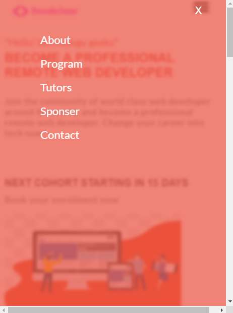
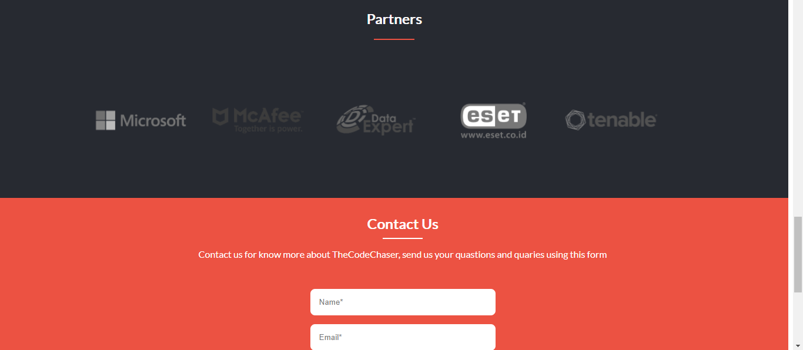

# TheCodeChaser Bootcamp

> ThecodeChaser Bootcamp is a web development boot camp website, responsive for desktop and mobile screens. It delivers all related information and user can submit their query and questions using the mentioned form. 

## Screenshots:

## Mobile




## Desktop




Porject's features are added into seperate branch to keep main branch safe.

## Built With

- HTML
- CSS
- Javascript

## Online live link

[Visit project online](https://thecodechaser.github.io/thecodechaser-web-bootcamp/)

## Getting Started

To get a local copy up and running follow these simple example steps.

### Prerequisites
- A text editor(preferably Visual Studio Code)

### Install
- [Git](https://git-scm.com/downloads)
- [Node](https://nodejs.org/en/download/)

### Usage
- Clone the repository using git clone ```git@github.com:thecodechaser/thecodechaser-web-bootcamp.git```
- cd into the project folder
- Run npm install

## Visit And Open Files

[Visit Repo](https://github.com/thecodechaser/thecodechaser-web-bootcamp)

## Download Repo

[Download Repo](https://github.com/thecodechaser/thecodechaser-web-bootcamp/archive/refs/heads/main.zip)

## Authors

👤 **Ranjeet Singh**

- GitHub: [@githubhandle](https://github.com/thecodechaser)
- Twitter: [@twitterhandle](https://twitter.com/thecodechaser)
- LinkedIn: [LinkedIn](https://linkedin.com/in/thecodechaser)

## 🤝 Contributing

Contributions, issues, and feature requests are welcome!

Feel free to check the [issues page](https://github.com/thecodechaser/thecodechaser-web-bootcamp/issues).

## Show your support

Give a ⭐️ if you like this project!

## Acknowledgments

- Inspired by original design for Creative Commons by Cindy Shin on [Behance](https://www.behance.net/gallery/29845175/CC-Global-Summit-2015).
- Inspiration: Microverse

## 📝 License

This project is [MIT](./MIT.md) licensed.
